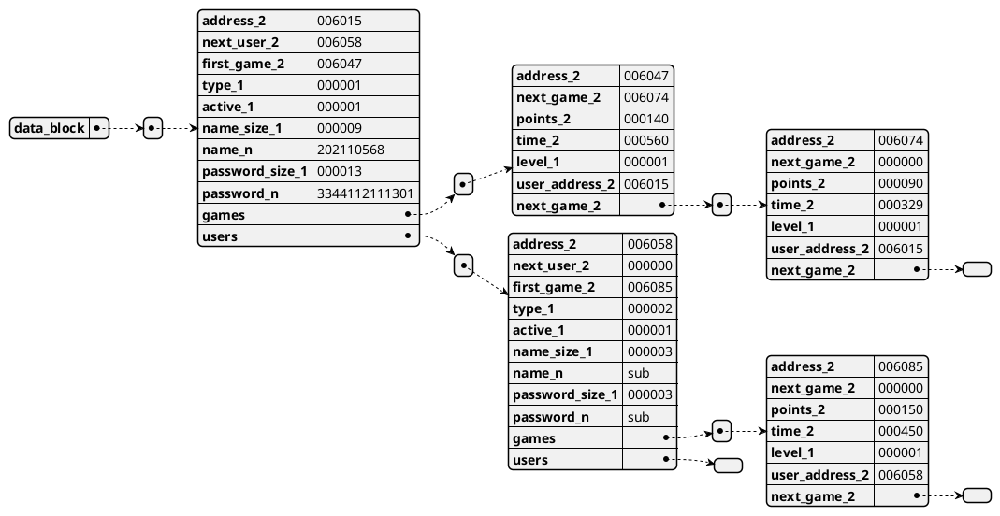

```plantuml
@startjson
{
"data_block": [
{
"address_2": "006015",
"next_user_2": "006058",
"first_game_2": "006047",
"type_1": "000001",
"active_1": "000001",
"name_size_1": "000009",
"name_n": "202110568",
"password_size_1": "000013",
"password_n": "3344112111301",
"games": [
{
"address_2": "006047",
"next_game_2": "006074",
"points_2": "000140",
"time_2": "000560",
"level_1": "000001",
"user_address_2": "006015",
"next_game_2": [
{
"address_2": "006074",
"next_game_2": "000000",
"points_2": "000090",
"time_2": "000329",
"level_1": "000001",
"user_address_2": "006015",
"next_game_2": [
]
}
]
}
]
,
"users": [
{
"address_2": "006058",
"next_user_2": "000000",
"first_game_2": "006085",
"type_1": "000002",
"active_1": "000001",
"name_size_1": "000003",
"name_n": "sub",
"password_size_1": "000003",
"password_n": "sub",
"games": [
{
"address_2": "006085",
"next_game_2": "000000",
"points_2": "000150",
"time_2": "000450",
"level_1": "000001",
"user_address_2": "006058",
"next_game_2": [
]
}
]
,
"users": [
]
}
]
}
]
}
@endjson
```
