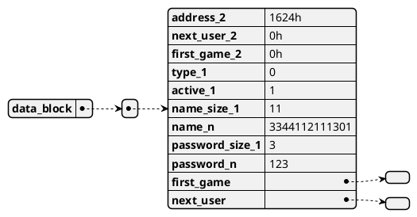
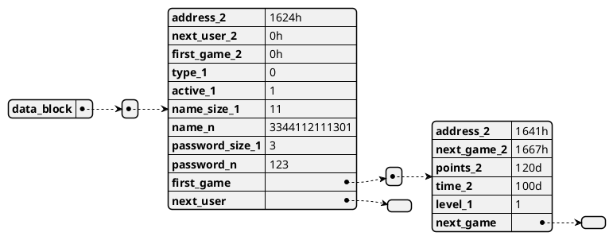
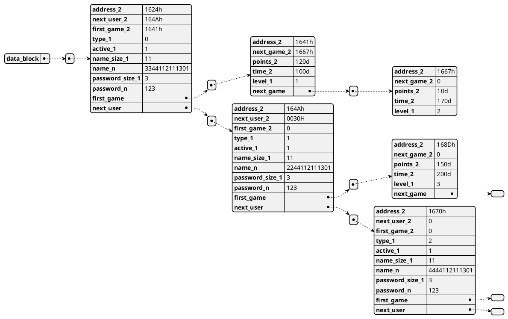

# **Proyecto 2**
### Universidad de San Carlos de Guatemala
### Facultad de Ingeniería
### Escuela de Ciencias y Sistemas
### Arquitectura de Computadores y Ensambladores 1
### Sección B
  

## **Manual Técnico**
  

| Nombre | Carnet | 
| --- | --- |
| Damián Ignacio Peña Afre | 202110568 |
----

# **Descripción General**

El proyecto consiste en una réplica del juego Pacman. Este juego contará con un CRUD o sistema para gestionar a usuarios, sus partidas y generar reportes.

# **Requerimientos**
- DOSBox
- MASM

# **Distribución de memoria**

Tanto para la gestión de usuarios como para la de sus partidas necesarias se utilizará etiqueta de memoria ubicada al final de la definición de todas las variables que necesite el programa. Esta etiqueta se llama `data_block` y para el caso de la última versión de este programa tiene un valor de `1624h`, a partir de esta dirección en adelande se guardarán los datos de los usuarios y sus partidas de manera consecutiva.

Para realizar esta implementación, es necesario el uso de una variable auxiliar (esta, declara antes de la mencionada `data_block`) que guarde la próxima posición de memoria libre, esta variable se llama `free_address` y por defecto tiene un valor de `0`, que representa un valor nulo.

Para ejemplificar la distribución de memoria, se dará el siguiente ejemplo:

* Queremos insertar el primer usuario, que en este caso será Administrador, sus propiedades de manera genérica son las siguientes

1. Tipo: 0 (Administrador) - Longitud: 1 byte
2. Estado: 1 (Activo) - Longitud: 1 byte
3. Username: 3344112111301 - Longitud: 11 bytes
4. Password: 123 - Longitud: 3 bytes

Para insertar este usuario, los primeros 2 bytes estarán reservador para hacer referencia a su propia dirección de inicio.

Este al ser el primer usuario, su dirección de inicio será la misma que la dirección de inicio de la etiqueta `data_block`, por lo que los primeros 2 bytes de este usuario estarán en la dirección `1624h`.

Si aumentamos en 2 la dirección de inicio, nos encontramos con la dirección `1626h`, que es la dirección donde se guardará la dirección del siguiente usuario, en este caso será nulo, por lo que los siguientes 2 bytes serán `0000h`.

De manera similar, es necesario almacenar la dirección de memoria del primer juego de este usuario, pero al estar inicializandolo apenas, los siguientes 2 bytes serán `0000h` nuevamente.

Luego de esto, se guardará el tipo de usuario, que en este caso es `0`, pero al solo ocupar 1 byte, el siguiente byte será `00h`.

El siguiente byte será el estado del usuario, que en este caso es `1`, por lo que el siguiente byte será `01h`.

Luego de esto, se guardará el username, que en este caso es `3344112111301`, pero para deliminar el final de este string, se guardará primero un byte que represente la longitud del string, en este caso es `0Bh` (11 en decimal), y luego se guardará el string, por lo que los siguientes 11 bytes serán `3344112111301`.

De igual forma para almacenar el password, se reserva un byte para la longitud del string, en este caso es `03h` (3 en decimal), y luego se guardará el string, por lo que los siguientes 3 bytes serán `123`.

Terminando de insertar todo, se guardará la variable `free_address` con el valor de `1624h + 2h + 2h + 2h + 1h + 1h + 1h + 11h + 1h + 3h = 1624h + 1Dh = 1641h`, que es la dirección de memoria donde se guardará el siguiente usuario o partida.

Hasta el momento la memoría se vería de la siguiente manera:

Si insertaramos inmediatamente una partida para este primer usuario, necesariamos insertar los siguientes datos:

1. Score: 120 - Longitud: 2 bytes
2. Tiempo: 100 - Longitud: 2 bytes
3. Nivel: 1 - Longitud: 1 byte

Para insertar esta partida, los primeros 2 bytes estarán reservador para hacer referencia a su propia dirección de inicio.

Ahora se iniciará desde la dirección que indique la variable `free_address`, que en este caso dejó de ser nula y tiene un valor `1641h`.

Si aumentamos en 2 la dirección de inicio, nos encontramos con la dirección `1643h`, que es la dirección donde se guardará la dirección del siguiente juego, en este caso será nulo, por lo que los siguientes 2 bytes serán `0000h`.

Luego se almacenará la cantidad de puntos obtenidos, que en este caso es `120`, pero al solo ocupar 2 bytes, los siguientes 2 bytes serán `0120d`.

Posteriormente se almacenará el tiempo de juego, que en este caso es `100`, pero al solo ocupar 2 bytes, los siguientes 2 bytes serán `0100d`.

Finalmente se almacenará el nivel alcanzado, que en este caso es `1`, pero al solo ocupar 1 byte, el siguiente byte será `01h`.

Hasta el momento la memoría se vería de la siguiente manera:

Este proceso se puede repetir en cualquier orden, insertando despues un usuario o una partida.

Presentamos a continuación una serie más compleja de inserciones, para ejemplificar el funcionamiento completo de la memoria.

* Posteriormente de la primera partida del usuario Administrador, se insertarán los siguientes elementos:

Se parte desde `free_address = 164Ah`

1. Usuario subadministrador - Longitud: 1Dh bytes - siguiente `free_address = 1667h`
2. Una partida para el usuario administrador - Longitud: 09h bytes - siguiente `free_address = 1670h`
3. Un usuario normal - Longitud: 1Dh bytes - siguiente `free_address = 168Dh`
4. Una partida para el usuario subadministrador - Longitud: 09h bytes

Finalmente la memoria se vería de la siguiente manera:

