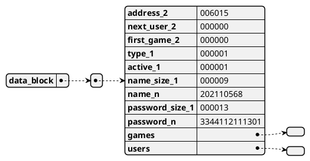
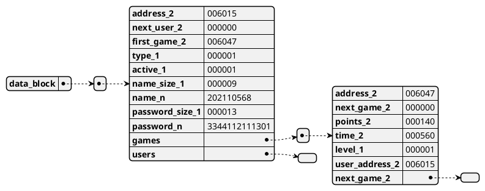
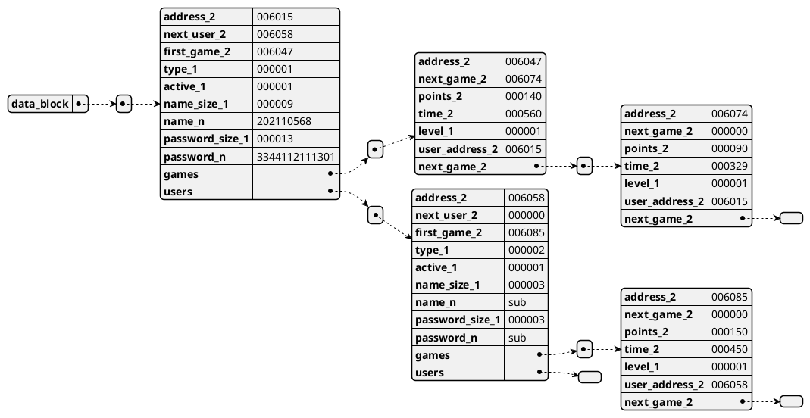
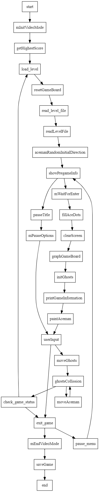

# **Proyecto 2**
### Universidad de San Carlos de Guatemala
### Facultad de Ingeniería
### Escuela de Ciencias y Sistemas
### Arquitectura de Computadores y Ensambladores 1
### Sección B
<br></br>

## **Manual Técnico**
<br></br>

| Nombre | Carnet | 
| --- | --- |
| Damián Ignacio Peña Afre | 202110568 |
----

# **Descripción General**

El proyecto consiste en una réplica del juego Pacman. Este juego contará con un CRUD o sistema para gestionar a usuarios, sus partidas y generar reportes.

# **Requerimientos**
- DOSBox
- MASM

# **Distribución de memoria**

Tanto para la gestión de usuarios como para la de sus partidas necesarias se utilizará etiqueta de memoria ubicada al final de la definición de todas las variables que necesite el programa. Esta etiqueta se llama `data_block` y para el caso de la última versión de este programa tiene un valor de `1624h`, a partir de esta dirección en adelande se guardarán los datos de los usuarios y sus partidas de manera consecutiva.

Para realizar esta implementación, es necesario el uso de una variable auxiliar (esta, declara antes de la mencionada `data_block`) que guarde la próxima posición de memoria libre, esta variable se llama `free_address` y por defecto tiene un valor de `0`, que representa un valor nulo.

Para ejemplificar la distribución de memoria, se dará el siguiente ejemplo:

* Queremos insertar el primer usuario, que en este caso será Administrador, sus propiedades de manera genérica son las siguientes

1. Tipo: 0 (Administrador) - Longitud: 1 byte
2. Estado: 1 (Activo) - Longitud: 1 byte
3. Username: 202110568 - Longitud: 9 bytes
4. Password: 3344112111301 - Longitud: 13 bytes

Para insertar este usuario, los primeros 2 bytes estarán reservador para hacer referencia a su propia dirección de inicio.

Este al ser el primer usuario, su dirección de inicio será la misma que la dirección de inicio de la etiqueta `data_block`, por lo que los primeros 2 bytes de este usuario estarán en la dirección `6015d`.

Si aumentamos en 2 la dirección de inicio, nos encontramos con la dirección `1617h`, que es la dirección donde se guardará la dirección del siguiente usuario, en este caso será nulo, por lo que los siguientes 2 bytes serán `0000h`.

De manera similar, es necesario almacenar la dirección de memoria del primer juego de este usuario, pero al estar inicializandolo apenas, los siguientes 2 bytes serán `0000h` nuevamente.

Luego de esto, se guardará el tipo de usuario, que en este caso es `0`, pero al solo ocupar 1 byte, el siguiente byte será `00h`.

El siguiente byte será el estado del usuario, que en este caso es `1`, por lo que el siguiente byte será `01h`.

Luego de esto, se guardará el username, que en este caso es `202110568`, pero para deliminar el final de este string, se guardará primero un byte que represente la longitud del string, en este caso es `9d`, y luego se guardará el string, por lo que los siguientes 9 bytes serán `202110568`.

De igual forma para almacenar el password, se reserva un byte para la longitud del string, en este caso es `13h` y luego se guardará el string, por lo que los siguientes 13 bytes serán `33444112111301`.

Terminando de insertar todo, se guardará la variable `free_address` con el valor de `6015d + 2d + 2d + 2d + 1d + 1d + 1d + 9d + 1h + 13h = 6058 + 1Dh = 6047d`, que es la dirección de memoria donde se guardará el siguiente usuario o partida.

Hasta el momento la memoría se vería de la siguiente manera:



Si insertaramos inmediatamente una partida para este primer usuario, necesariamos insertar los siguientes datos:

1. Score: x - Longitud: 2 bytes
2. Tiempo: x - Longitud: 2 bytes
3. Nivel: x - Longitud: 1 byte

Para insertar esta partida, los primeros 2 bytes estarán reservador para hacer referencia a su propia dirección de inicio.

Ahora se iniciará desde la dirección que indique la variable `free_address`, que en este caso dejó de ser nula y tiene un valor `6047d`.

Si aumentamos en 2 la dirección de inicio, nos encontramos con la dirección `6049d`, que es la dirección donde se guardará la dirección del siguiente juego, en este caso será nulo, por lo que los siguientes 2 bytes serán `0000h`.

Luego se almacenará la cantidad de puntos obtenidos, que en este caso es `140`, pero al solo ocupar 2 bytes, los siguientes 2 bytes serán `140d`.

Posteriormente se almacenará el tiempo de juego, que en este caso es `560d`, por motivos de implementación esta cantidad representa la diferencia en centésimas de segundo de 2 marcas temporales, al final e inicio del juego, solo ocupa 2 bytes, por lo que los siguientes 2 bytes serán `560d`.

Se almacenará el nivel alcanzado, que en este caso es `1`, pero al solo ocupar 1 byte, el siguiente byte será `1d`.

Y por último se guarda la dirección del usuario al que pertenece este juego, que en este caso es `6015d`, por lo que los siguientes 2 bytes serán `6015d`, esto por motivos de mantener la referencia en ciertas evaluaciones o recorridos en memoria.

Hasta el momento la memoría se vería de la siguiente manera:




Este proceso se puede repetir en cualquier orden, insertando despues un usuario o una partida.

Presentamos a continuación una serie más compleja de inserciones, para ejemplificar el funcionamiento completo de la memoria.

* Posteriormente de la primera partida del usuario Administrador, se insertarán los siguientes elementos:

Se parte desde `free_address = 6047d (ultima dirección libre) + (2d + 2d + 2d + 2d + 1d+ 2d)(bytes requeridos por partida) = 6058d (nueva dirección libre)`

1. Usuario subadministrador - Longitud: 16 bytes - siguiente `free_address = 6074d`
2. Una partida para el usuario administrador - Longitud: 11 bytes - siguiente `free_address = 6085`
3. Una partida para el usuario subadministrador

Finalmente la memoria se vería de la siguiente manera:



**Código**

Se detallan las subrutinas más importantes:

`graphGameBoard`

Este código es un procedimiento llamado "graphGameBoard" que se encarga de dibujar en pantalla un tablero de juego. Comienza obteniendo la dirección de memoria del tablero de juego y luego itera sobre cada fila y columna del tablero. Para cada posición en el tablero, determina qué objeto debe dibujar (por ejemplo, pared, punto, portal) y luego obtiene la dirección de memoria del sprite correspondiente. Finalmente, llama a un procedimiento llamado "paintSprite" para dibujar el sprite en pantalla. Después de dibujar el tablero, también dibuja elementos estáticos como el puntaje, el tiempo y el puntaje máximo en posiciones específicas en la pantalla.

```asm 
graphGameBoard proc 

    lea di, game_board
    mov cx, 0 ; y coordinate

    graph_next_row:
        mov ax, 0 ; x coordinate

    graph_next_col:

        call getGameObject ; get object code
        cmp dx, 0fh ; empty space
        jg not_a_wall ; not a wall (or empty space)

        ; Get wall sprite offset

        push ax ; save x coordinate

        lea di, sprite_walls ; di = wall_sprite offset
        mov ax, dx ; ax = wall type
        mov bx, sprite_size ; bx = sprite size
        mul bx ; ax = wall type * sprite size
        add di, ax ; di = wall_sprite offset + wall type * sprite size

        pop ax ; restore x coordinate

        ; Paint wall sprite
        jmp paint_board_object

        not_a_wall:

        lea di, sprite_ace_dot
        cmp dx, 13h ; ace dot
        je paint_board_object

        lea di, sprite_power_dot
        cmp dx, 14h ; power dot
        je paint_board_object

        lea di, sprite_walls
        cmp dx, 15h ; > 15d -> Portal
        jge paint_board_object


        jmp no_paint_object

        paint_board_object:
        call paintSprite

        no_paint_object:

        inc ax ; next column
        cmp ax, 28h ; 40d columns
        jne graph_next_col ; not 40d columns

        inc cx ; next row
        cmp cx, 19h ; 25d rows
        jne graph_next_row ; not 25d rows

    ; Static elements [score, time, max]

    ; score : row = 0; col = 0
    mov ax, 0
    mov cx, 0
    lea di, sprite_coin
    call paintSprite

    ; time : row = 0; col = 29
    mov ax, 01dh ; 29d
    mov cx, 0
    lea di, sprite_time
    call paintSprite

    ; max : row = 24; col = 3
    mov ax, 10h
    mov cx, 18h
    lea di, sprite_plus
    call paintSprite

    mov ah, 02h 
    mov bh, 0
    mov dh, 18h ; row
    mov dl, 11h ; column
    int 10h

    mov ax, max_score
    call numberToString
    mPrint numberString

graphGameBoard endp

```


`setGameObject`
Este código es un procedimiento llamado "setGameObject" que se utiliza para establecer el objeto en una posición específica del tablero de juego. El procedimiento toma como entrada la coordenada x, la coordenada y y el código del objeto a colocar en esa posición. Primero, se intercambia la coordenada x con la coordenada y y se multiplica la coordenada y por 40 (el ancho del tablero en términos de columnas) para calcular la posición correcta en el vector unidimensional que representa el tablero. Luego, se agrega la coordenada x a este valor para obtener la posición exacta en el tablero. Finalmente, el objeto se establece en esta posición actualizando el valor en el vector game_board en la dirección de memoria calculada.

```asm
setGameObject proc
    push ax
    push cx
    push di
    push dx

    mov dh, 28h ; 40d columns
    xchg ax, cx ; x <-> y

    mul dh ; y * 40d
    add cx, ax ; y * 40d + x

    lea di, game_board
    add di, cx ; di = game_board offset + y * 40d + x

    mov [di], dl ; game_board[y * 40d + x] = object code

    pop dx
    pop di
    pop cx
    pop ax

    ret
setGameObject endp

```

`paintSprite`

Este código define un procedimiento llamado paintSprite que se utiliza para pintar un sprite en el área de visualización del juego. El procedimiento recibe el código de sprite y la posición (fila y columna) donde debe pintarse el sprite. El código de sprite se utiliza para determinar qué sprite se debe pintar (cada sprite tiene un código diferente). El procedimiento utiliza la memoria de video en el modo gráfico 320x200 y dibuja el sprite en el área de visualización en la posición indicada. El sprite se dibuja utilizando ciclos para recorrer todas las filas y columnas del sprite y dibujar cada píxel correspondiente en la memoria de video. El procedimiento utiliza una técnica de doble búfer para evitar parpadeos al dibujar el sprite en la pantalla.

```asm	

paintSprite proc

    push ax
    push bx
    push cx
    push dx
    push di

    mov bx, 0 
    mov dl, 08 ; 8 rows
    mul dl ; AX = x * 8
    add bx, ax ; bx = x * 8

    xchg ax, cx ; AX = y; CX = x * 8
    mul dl ; AX = y * 8
    mov dx, 140h ; 320d -> pixel width
    mul dx ; AX = y * 8 * 320d
    add bx, ax ; bx = x * 8 + y * 8 * 320d
    end_position:
        mov cx, 8 ; 8 rows
    
    paint_sprite_row:
        push cx
        mov cx, 8 ; 8 columns

    paint_sprite_col:

        mov al, [di] ; get sprite column
        push ds ; save ds

        mov dx, 0A000h ; video memory
        mov ds, dx ; ds = video memory

        mov [BX], AL ; paint sprite

        inc bx ; next column on video memory
        inc di ; next column on sprite
        
        pop ds ; restore ds

        loop paint_sprite_col

        pop cx ; restore row counter
        sub bx, 8 ; go to the next row on video memory
        add bx, 140 ; 320d -> pixel width
        loop paint_sprite_row


    pop di
    pop dx
    pop cx
    pop bx
    pop ax

    ret

paintSprite endp

```

`startGame`

Este código es un procedimiento llamado "startGame" que inicia el juego y controla su secuencia. Primero inicializa variables importantes, como la puntuación, la salud del jugador y el nivel actual. Luego carga el primer nivel del archivo correspondiente y muestra información previa al juego. A continuación, llama a otros procedimientos para llenar los puntos de Ace, limpiar la pantalla y graficar el tablero del juego.

Después, entra en un bucle de juego que se repite hasta que se cumpla alguna de las condiciones de finalización del juego, como perder todas las vidas, pausar el juego o completar todos los niveles. En cada iteración del bucle, se llama a otros procedimientos para controlar las entradas del usuario, mover los fantasmas y el jugador, y verificar las colisiones.

Si el juego termina, el procedimiento llama a una función para guardar la puntuación y termina. Si el juego se pausa, se muestra un menú de pausa antes de continuar con el juego.

```asm
startGame proc

        mInitVideoMode
        mov differenceTimestamp, 0
        mov levelCounter, 1
        mov aceman_hp, 3
        mov gamePoints, 0
        mov pauseGame, 0
        mov gameLost, 0

        call getHighestScore
        mov max_score, dx

        call getInitialTime

        load_level:
        mov endGame, 0

        call resetGameBoard

        ; load level
        lea dx, firstLevelFile
        cmp levelCounter, 1
        je read_level_file

        lea dx, secondLevelFile
        cmp levelCounter, 2
        je read_level_file

        lea dx, thirdLevelFile

        read_level_file:
        call readLevelFile

        call acemanRandomInitialDirection

        ; Show pregamescreen
        call showPregameInfo
        mWaitForEnter

        call fillAceDots

        call clearScreen
        call graphGameBoard
        call initGhosts
    game_sequence:
        call printGameInformation
		call paintAceman
		
        call userInput

        mov check_ghost_collission, 1

        call moveGhosts
        call ghostsCollission
        call moveAceman
        call ghostsCollission

        mov dl, gameLost
        cmp dl, 1
        je exit_game

        mov dl, pauseGame
        cmp dl, 1
        je pause_menu

        mov dl, endGame
        cmp dl, 0
        je game_sequence

        inc levelCounter
        cmp levelCounter, 4
        jne load_level

        exit_game:
        mEndVideoMode

        ; Register score
        call saveGame
        ret ; -> return to caller

        pause_menu:
            call showPregameInfo
            call pauseTitle
            mPauseOptions

    startGame endp


```

Este procedemiento se ve descrito por el siguiente diagrama:




`bubbleSort`

El código que has proporcionado es un procedimiento escrito en lenguaje ensamblador (Assembly) que implementa el algoritmo de ordenamiento Bubble Sort. El Bubble Sort es un algoritmo simple pero ineficiente que ordena una lista comparando pares adyacentes de elementos y intercambiándolos si están en el orden incorrecto. Este proceso se repite hasta que la lista esté ordenada.

El procedimiento comienza definiendo algunas variables, como i, j, y cx. i e j son contadores que se usan para iterar sobre los elementos de la lista, y cx se usa para almacenar valores temporales.

El bucle exterior bubble_sort_outer_loop itera sobre la lista completa, y el bucle interior bubble_sort_inner_loop itera sobre pares adyacentes de elementos. La comparación y el intercambio de elementos se realizan en el bucle interior.

La instrucción call getValueFromIndex se usa para obtener los valores de los elementos a[j] y a[j+1] de la lista. Estos valores se comparan y se intercambian si es necesario. Si la lista se está ordenando en orden ascendente, los elementos se intercambian si a[j] es mayor que a[j+1]. Si la lista se está ordenando en orden descendente, los elementos se intercambian si a[j] es menor que a[j+1].

Después de comparar y posiblemente intercambiar los elementos, el bucle interior bubble_sort_inner_loop continúa iterando hasta que se hayan comparado y posiblemente intercambiado todos los pares de elementos en la lista. Luego, el bucle exterior bubble_sort_outer_loop avanza a la siguiente iteración y repite el proceso.

Una vez que la lista está ordenada, el procedimiento termina y devuelve el control al programa principal.

```asm 

bubbleSort proc
    
    ; si prev address
    ; di next address

    mov cx, 1 ; i = 1
    mov i, cx

    bubble_sort_outer_loop:
        mov cx, 0 ; j = 0
        mov j, cx

        bubble_sort_inner_loop:

            ; a[j]
            mov cx, j
            call getValueFromIndex
            mov ax, dx ; AX = a[j]

            ; a[j+1]
            mov cx, j
            inc cx
            call getValueFromIndex

            ; a[j] > a[j+1] or a[j] < a[j+1]
            cmp orientation, 0 ; ascending
            je ascending_condition

            ; - descending -
            cmp ax, dx ; a[j] < a[j+1]
            jl exchange_address
            jmp next_inner_iteration

            ascending_condition:
                cmp ax, dx ; a[j] > a[j+1]
                jg exchange_address
                jmp next_inner_iteration
            
            exchange_address:
                mov ax, j
                mov ch, al ; ch = j
                inc ax
                mov cl, al ; cl = j + 1
                call exchangeAddressFromindex
                jmp next_inner_iteration

            next_inner_iteration:
                mov cx, j
                inc cx
                mov j, cx ; j++

                mov ax, addressSize
                dec ax

                cmp cx, ax
                jl bubble_sort_inner_loop

            next_outer_iteration:
                mov cx, i
                inc cx
                mov i, cx ; i++

                mov ax, addressSize
                ; dec ax

                cmp cx, ax
                jl bubble_sort_outer_loop
                ; jg end_bubble_sort

    end_bubble_sort:
    ret
bubbleSort endp

```