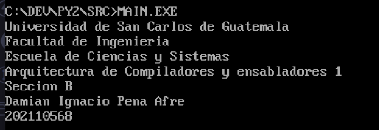
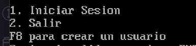
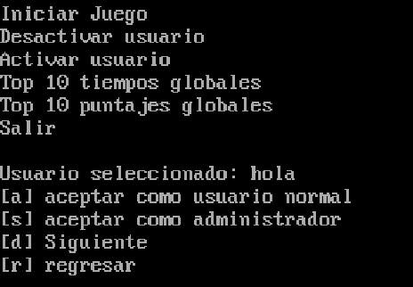
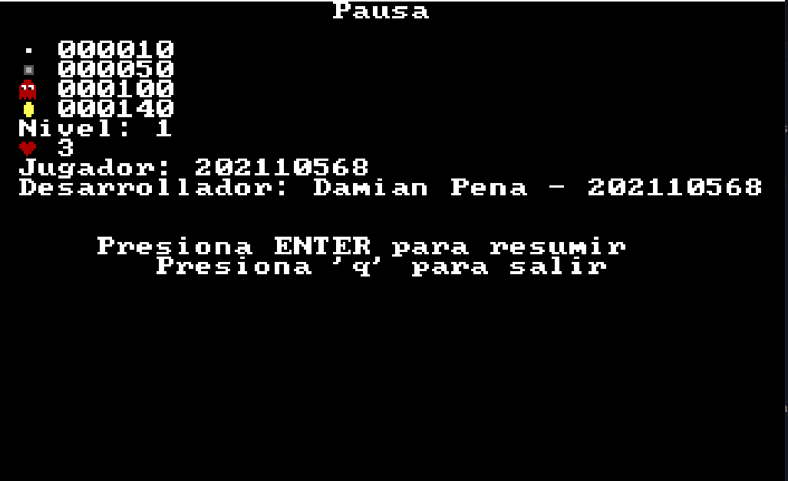

# **Proyecto 2**
### Universidad de San Carlos de Guatemala
### Facultad de Ingeniería
### Escuela de Ciencias y Sistemas
### Arquitectura de Computadores y Ensambladores 1
### Sección B
  

## **Manual de Usuario**
  

| Nombre | Carnet | 
| --- | --- |
| Damián Ignacio Peña Afre | 202110568 |
----

# **Descripción General**

El proyecto consiste en una réplica del juego Pacman. Este juego contará con un CRUD o sistema para gestionar a usuarios, sus partidas y generar reportes.

# **Requerimientos**
- DOSBox
- MASM

# **Ejecución**

1. Abrir DOSBox
2. Compilar el archivo `main.asm` con el comando `ml main.asm`
3. Ejecutar el archivo `main.exe` con el comando `main.exe`

# **Menus**

Al iniciar la aplicación se mostratrá el siguiente mensaje de bienvenida:

Pasando así, al menú principal:

Si se selecciona la opción para crear un usuario con F8, se mostrará el siguiente menú:

Esto creará un usuario inactivo.

Ahora, cuando se inicia sesión con un usuario administrador, se mostrará el siguiente menú:

La opción para agregar un usuario, mostrará el siguiente menú:

Y mostrará el siguiente mensaje de confirmación:

Al no encontrar otro usuario saldrá de la lista, volviendo al menú.

Y de forma similar para desactivar un usuario:

De igual forma para el resto de usuarios es posible listar un top 10, ya sea de tiempos o puntajes y de manera personal o global.

Asimismo, todos los usuario pueden iniciar una partida, mostrando la información del inicio de partida. Al principio, del primer nivel:

Posteriormente, se muestra en sí el inicio de la partida:

En cualquier momento con `ESC` es posible pausear el juego, mostrando el siguiente menú:

En resumen, estas son las reglas del juego:

* El juego consiste en un laberinto de paredes, ace-dots y power-dots, en un tablero de 8x8 pixeles.
* Hay dos personajes principales: aceman y los fantasmas.
* Aceman se mueve en una dirección constante, pero puede cambiar de dirección en las intersecciones.
* Aceman tiene dos estados, con la boca abierta y cerrada, y debe tener ambos estados para cada dirección posible.
* Solo Aceman puede comer ace-dots y power-dots.
* Los fantasmas se mueven libremente por el laberinto, pero no pueden pasar a través de las paredes.
* Los fantasmas tienen una dirección de movimiento y pueden cambiar de dirección al azar cuando se encuentran en una intersección.
* Los power-dots hacen que todos los fantasmas se vuelvan comestibles para aceman durante 12 segundos y otorgan más puntos que los ace-dots.
* Los fantasmas reaparecerán en su casa después de ser comidos, pero no serán comestibles después de salir de ella.
* Hay portales en el laberinto que permiten a Aceman pasar de una parte del laberinto a otra.
* Antes de comenzar el nivel, se debe mostrar la descripción de los puntos a otorgar por cada elemento, el puntaje actual, el nivel, las vidas, el nombre del jugador y el del desarrollador.