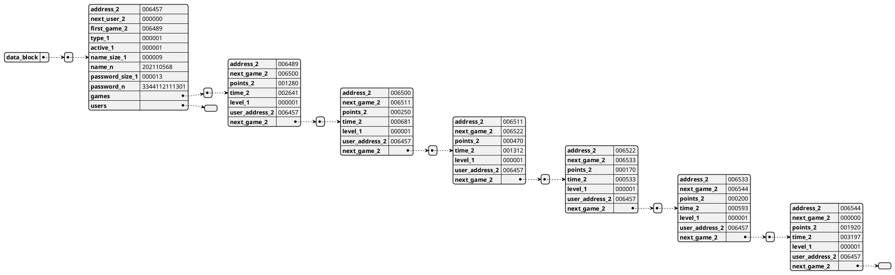

```plantuml
@startjson
{
"data_block": [
{
"address_2": "006457",
"next_user_2": "000000",
"first_game_2": "006489",
"type_1": "000001",
"active_1": "000001",
"name_size_1": "000009",
"name_n": "202110568",
"password_size_1": "000013",
"password_n": "3344112111301",
"games": [
{
"address_2": "006489",
"next_game_2": "006500",
"points_2": "001280",
"time_2": "002641",
"level_1": "000001",
"user_address_2": "006457",
"next_game_2": [
{
"address_2": "006500",
"next_game_2": "006511",
"points_2": "000250",
"time_2": "000681",
"level_1": "000001",
"user_address_2": "006457",
"next_game_2": [
{
"address_2": "006511",
"next_game_2": "006522",
"points_2": "000470",
"time_2": "001312",
"level_1": "000001",
"user_address_2": "006457",
"next_game_2": [
{
"address_2": "006522",
"next_game_2": "006533",
"points_2": "000170",
"time_2": "000533",
"level_1": "000001",
"user_address_2": "006457",
"next_game_2": [
{
"address_2": "006533",
"next_game_2": "006544",
"points_2": "000200",
"time_2": "000593",
"level_1": "000001",
"user_address_2": "006457",
"next_game_2": [
{
"address_2": "006544",
"next_game_2": "000000",
"points_2": "001920",
"time_2": "003197",
"level_1": "000001",
"user_address_2": "006457",
"next_game_2": [
]
}
]
}
]
}
]
}
]
}
]
}
]
,
"users": [
]
}
]
}
@endjson
```
