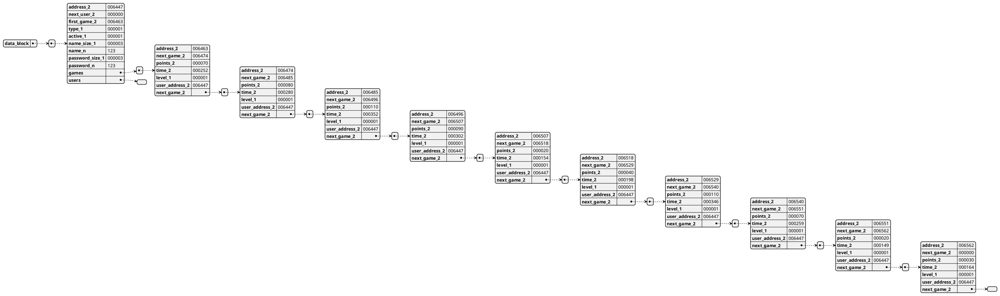

```plantuml
@startjson
{
"data_block": [
{
"address_2": "006447",
"next_user_2": "000000",
"first_game_2": "006463",
"type_1": "000001",
"active_1": "000001",
"name_size_1": "000003",
"name_n": "123",
"password_size_1": "000003",
"password_n": "123",
"games": [
{
"address_2": "006463",
"next_game_2": "006474",
"points_2": "000070",
"time_2": "000252",
"level_1": "000001",
"user_address_2": "006447",
"next_game_2": [
{
"address_2": "006474",
"next_game_2": "006485",
"points_2": "000080",
"time_2": "000280",
"level_1": "000001",
"user_address_2": "006447",
"next_game_2": [
{
"address_2": "006485",
"next_game_2": "006496",
"points_2": "000110",
"time_2": "000352",
"level_1": "000001",
"user_address_2": "006447",
"next_game_2": [
{
"address_2": "006496",
"next_game_2": "006507",
"points_2": "000090",
"time_2": "000302",
"level_1": "000001",
"user_address_2": "006447",
"next_game_2": [
{
"address_2": "006507",
"next_game_2": "006518",
"points_2": "000020",
"time_2": "000154",
"level_1": "000001",
"user_address_2": "006447",
"next_game_2": [
{
"address_2": "006518",
"next_game_2": "006529",
"points_2": "000040",
"time_2": "000198",
"level_1": "000001",
"user_address_2": "006447",
"next_game_2": [
{
"address_2": "006529",
"next_game_2": "006540",
"points_2": "000110",
"time_2": "000346",
"level_1": "000001",
"user_address_2": "006447",
"next_game_2": [
{
"address_2": "006540",
"next_game_2": "006551",
"points_2": "000070",
"time_2": "000259",
"level_1": "000001",
"user_address_2": "006447",
"next_game_2": [
{
"address_2": "006551",
"next_game_2": "006562",
"points_2": "000020",
"time_2": "000149",
"level_1": "000001",
"user_address_2": "006447",
"next_game_2": [
{
"address_2": "006562",
"next_game_2": "000000",
"points_2": "000030",
"time_2": "000164",
"level_1": "000001",
"user_address_2": "006447",
"next_game_2": [
]
}
]
}
]
}
]
}
]
}
]
}
]
}
]
}
]
}
]
}
]
,
"users": [
]
}
]
}
@endjson
```
