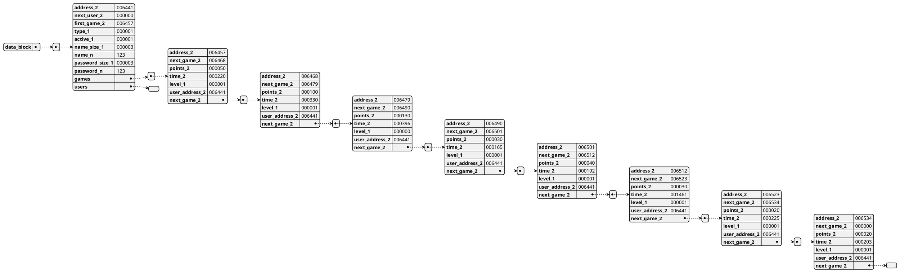

```plantuml
@startjson
{
"data_block": [
{
"address_2": "006441",
"next_user_2": "000000",
"first_game_2": "006457",
"type_1": "000001",
"active_1": "000001",
"name_size_1": "000003",
"name_n": "123",
"password_size_1": "000003",
"password_n": "123",
"games": [
{
"address_2": "006457",
"next_game_2": "006468",
"points_2": "000050",
"time_2": "000220",
"level_1": "000001",
"user_address_2": "006441",
"next_game_2": [
{
"address_2": "006468",
"next_game_2": "006479",
"points_2": "000100",
"time_2": "000330",
"level_1": "000001",
"user_address_2": "006441",
"next_game_2": [
{
"address_2": "006479",
"next_game_2": "006490",
"points_2": "000130",
"time_2": "000396",
"level_1": "000000",
"user_address_2": "006441",
"next_game_2": [
{
"address_2": "006490",
"next_game_2": "006501",
"points_2": "000030",
"time_2": "000165",
"level_1": "000001",
"user_address_2": "006441",
"next_game_2": [
{
"address_2": "006501",
"next_game_2": "006512",
"points_2": "000040",
"time_2": "000192",
"level_1": "000001",
"user_address_2": "006441",
"next_game_2": [
{
"address_2": "006512",
"next_game_2": "006523",
"points_2": "000030",
"time_2": "001461",
"level_1": "000001",
"user_address_2": "006441",
"next_game_2": [
{
"address_2": "006523",
"next_game_2": "006534",
"points_2": "000020",
"time_2": "000225",
"level_1": "000001",
"user_address_2": "006441",
"next_game_2": [
{
"address_2": "006534",
"next_game_2": "000000",
"points_2": "000020",
"time_2": "000203",
"level_1": "000001",
"user_address_2": "006441",
"next_game_2": [
]
}
]
}
]
}
]
}
]
}
]
}
]
}
]
}
]
,
"users": [
]
}
]
}
@endjson
```
