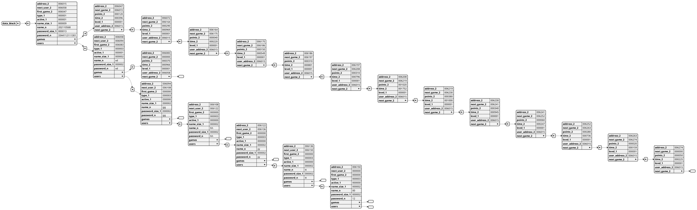

```plantuml
@startjson
{
"data_block": [
{
"address_2": "006015",
"next_user_2": "006058",
"first_game_2": "006047",
"type_1": "000001",
"active_1": "000001",
"name_size_1": "000009",
"name_n": "202110568",
"password_size_1": "000013",
"password_n": "3344112111301",
"games": [
{
"address_2": "006047",
"next_game_2": "006072",
"points_2": "000120",
"time_2": "000396",
"level_1": "000001",
"user_address_2": "006015",
"next_game_2": [
{
"address_2": "006072",
"next_game_2": "006164",
"points_2": "000290",
"time_2": "000969",
"level_1": "000001",
"user_address_2": "006015",
"next_game_2": [
{
"address_2": "006164",
"next_game_2": "006175",
"points_2": "000040",
"time_2": "000220",
"level_1": "000001",
"user_address_2": "006015",
"next_game_2": [
{
"address_2": "006175",
"next_game_2": "006186",
"points_2": "000150",
"time_2": "000549",
"level_1": "000001",
"user_address_2": "006015",
"next_game_2": [
{
"address_2": "006186",
"next_game_2": "006197",
"points_2": "000310",
"time_2": "000801",
"level_1": "000001",
"user_address_2": "006015",
"next_game_2": [
{
"address_2": "006197",
"next_game_2": "006208",
"points_2": "000310",
"time_2": "000796",
"level_1": "000001",
"user_address_2": "006015",
"next_game_2": [
{
"address_2": "006208",
"next_game_2": "006219",
"points_2": "001020",
"time_2": "001752",
"level_1": "000001",
"user_address_2": "006015",
"next_game_2": [
{
"address_2": "006219",
"next_game_2": "006230",
"points_2": "000380",
"time_2": "001000",
"level_1": "000001",
"user_address_2": "006015",
"next_game_2": [
{
"address_2": "006230",
"next_game_2": "006241",
"points_2": "000340",
"time_2": "000945",
"level_1": "000001",
"user_address_2": "006015",
"next_game_2": [
{
"address_2": "006241",
"next_game_2": "006252",
"points_2": "000060",
"time_2": "000247",
"level_1": "000001",
"user_address_2": "006015",
"next_game_2": [
{
"address_2": "006252",
"next_game_2": "006263",
"points_2": "000280",
"time_2": "000736",
"level_1": "000001",
"user_address_2": "006015",
"next_game_2": [
{
"address_2": "006263",
"next_game_2": "006274",
"points_2": "000020",
"time_2": "000159",
"level_1": "000001",
"user_address_2": "006015",
"next_game_2": [
{
"address_2": "006274",
"next_game_2": "000000",
"points_2": "000050",
"time_2": "000225",
"level_1": "000001",
"user_address_2": "006015",
"next_game_2": [
]
}
]
}
]
}
]
}
]
}
]
}
]
}
]
}
]
}
]
}
]
}
]
}
]
}
]
,
"users": [
{
"address_2": "006058",
"next_user_2": "006094",
"first_game_2": "006083",
"type_1": "000003",
"active_1": "000001",
"name_size_1": "000002",
"name_n": "xd",
"password_size_1": "000002",
"password_n": "xd",
"games": [
{
"address_2": "006083",
"next_game_2": "000000",
"points_2": "000370",
"time_2": "000966",
"level_1": "000001",
"user_address_2": "006058",
"next_game_2": [
]
}
]
,
"users": [
{
"address_2": "006094",
"next_user_2": "006108",
"first_game_2": "000000",
"type_1": "000003",
"active_1": "000000",
"name_size_1": "000002",
"name_n": "gg",
"password_size_1": "000002",
"password_n": "gg",
"games": [
]
,
"users": [
{
"address_2": "006108",
"next_user_2": "006122",
"first_game_2": "000000",
"type_1": "000003",
"active_1": "000000",
"name_size_1": "000002",
"name_n": "hh",
"password_size_1": "000002",
"password_n": "hh",
"games": [
]
,
"users": [
{
"address_2": "006122",
"next_user_2": "006136",
"first_game_2": "000000",
"type_1": "000003",
"active_1": "000000",
"name_size_1": "000002",
"name_n": "yy",
"password_size_1": "000002",
"password_n": "yy",
"games": [
]
,
"users": [
{
"address_2": "006136",
"next_user_2": "006150",
"first_game_2": "000000",
"type_1": "000003",
"active_1": "000000",
"name_size_1": "000002",
"name_n": "tt",
"password_size_1": "000002",
"password_n": "tt",
"games": [
]
,
"users": [
{
"address_2": "006150",
"next_user_2": "000000",
"first_game_2": "000000",
"type_1": "000003",
"active_1": "000000",
"name_size_1": "000002",
"name_n": "00",
"password_size_1": "000002",
"password_n": "12",
"games": [
]
,
"users": [
]
}
]
}
]
}
]
}
]
}
]
}
]
}
]
}
@endjson
```
